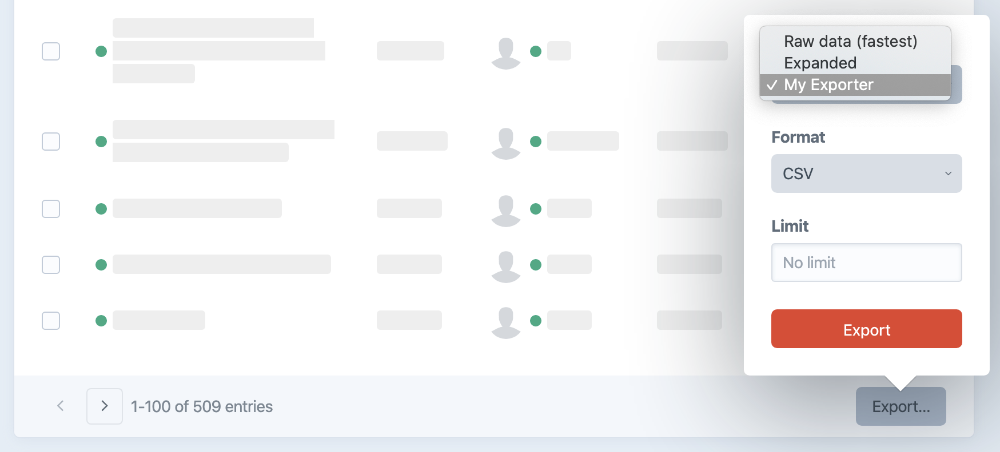

# Element Exporters

[[toc]]

Craft 3.4 introduced the option to export elements as CSV, XML, or JSON files.


It uses the concept of Element Exporters to faciliate this from element views in the control panel and ships with two exporter types out of the box:

1. **Raw Data (fastest)**: a simple “dump” of all the element columns from the database
2. **Expanded**: includes raw data specific to the element type _and_ a representation of [related elements](../relations.md), which can be an array of related IDs or JSON blobs depending on the field type

PHP developers can write their own custom exporters and make them available in the control panel.

## Creating Custom Exporters

A custom exporter class is required, and it should extend <api:craft\base\ElementExporter>.

The class `export()` method should return an array whose keys will be used as column titles in a CSV, node names in XML, and object keys in JSON.

The following example exporter provides the title, status, and URL of an element along with titles of any elements related in a field called `myRelatedElements`:

```php
<?php

namespace ns\prefix\exporters;

use Craft;
use craft\base\Field;
use craft\base\Element;
use craft\base\ElementExporter;
use craft\elements\db\ElementQuery;
use craft\base\EagerLoadingFieldInterface;
use craft\elements\db\ElementQueryInterface;

class MyCustomExporter extends ElementExporter
{
    /**
     * @inheritdoc
     */
    public static function displayName(): string
    {
        return Craft::t('app', 'My Exporter');
    }

    /**
     * @inheritdoc
     */
    public function export(ElementQueryInterface $query): array
    {
        $results = [];

        // Eager-load as much as we can
        $eagerLoadableFields = [];

        foreach (Craft::$app->getFields()->getAllFields() as $field)
        {
            /** @var Field $field */
            if ($field instanceof EagerLoadingFieldInterface)
            {
                $eagerLoadableFields[] = $field->handle;
            }
        }

        /** @var ElementQuery $query */
        $query->with($eagerLoadableFields);


        /** @var Element $element */
        foreach ($query->each() as $element)
        {
            $thisData = [
                'Title'   => $element->title ?? '',
                'Status'  => ucfirst($element->status),
                /* Array of element titles, from eager-loaded relations above */
                'Related' => $this->collectRelatedFieldTitles(
                    $element->myRelatedElements
                 ),
                'URL'     => $element->getUrl(),
            ];

            $results[] = $thisData;
        }

        return $results;
    }

    /**
     * Extracts element titles from an array of related elements
     *
     * @param Element[] $elements
     * @return array
     */
    private function collectRelatedFieldTitles(array $elements): array
    {
        $titles = [];

        foreach ($elements as $element)
        {
            /** @var Element $element */
            $titles[] = $element->title;
        }

        return $titles;
    }
}
```

The user-selected output format determines how a value will be rendered. Here’s how the `Related` example above would appear in each format:

::: code

```csv
Related
"[""Value 1"",""Value 2""]"
```

```json
"Related": [
    "Value 1",
    "Value 2"
]
```

```xml
<Related>
    <elementType>Value 1</elementType>
    <elementType>Value 2</elementType>
</Related>
```

:::

Note that in the XML example above, `elementType` refers to the element being exported and **not** the type of each related element. A Craft Commerce product export that includes related entries might look like this:

```xml
<RelatedEntries>
    <product>Related Entry One</product>
    <product>Related Entry Two</product>
</RelatedEntries>
```

::: tip
Export formats like XML have limitations for valid node names, so it’s best to avoid using spaces in your keys and ideal to use PascalCase (UpperCamelCase). If your key can’t be used, or if the array is un-keyed such as an array of values, the element type (user, entry, etc.) will be used as the key.
:::

## Registering Custom Exporters

Once you’ve written your custom exporter class, you need to register it for use.

You can do this by subscribing to the `EVENT_REGISTER_EXPORTERS` event in your module or plugin’s `init()` method and adding your exporter class to the `exporters` array:

```php
use ns\prefix\exporters\MyCustomExporter;
use craft\base\Element;
use yii\base\Event;

Event::on(
    Element::class,
    Element::EVENT_REGISTER_EXPORTERS,
    function (Event $event) {
        // append custom exporter to the set
        $event->exporters[] = MyCustomExporter::class;
    }
);
```

If you’d rather _replace_ the available exporters instead of adding yours to those already available, provide your own array instead of appending your class to it:

```php
// replace exporter set
$event->exporters = [ MyCustomExporter::class ];
```

Your custom exporter should now be available to you in the Elements Export button



The example above will make the exporter available to all element types. To restrict the exporter to a particular type of element (Entry, Category, Product etc.) you can register against only those types. This example adds the custom exporter only for Craft Commerce products:

```php{2,5,6,7}
use prefix\exporters\MyCustomExporter;
use craft\commerce\elements\Product;
use yii\base\Event;

Event::on(
    Product::class,
    Product::EVENT_REGISTER_EXPORTERS,
    function (Event $event) {
        // append custom exporter to the set
        $event->exporters[] = MyCustomExporter::class;
    }
);
```
