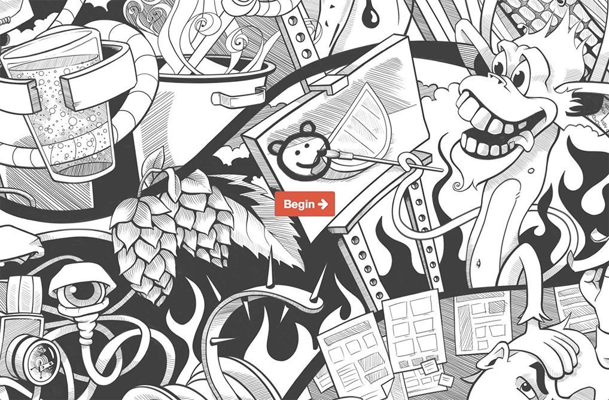
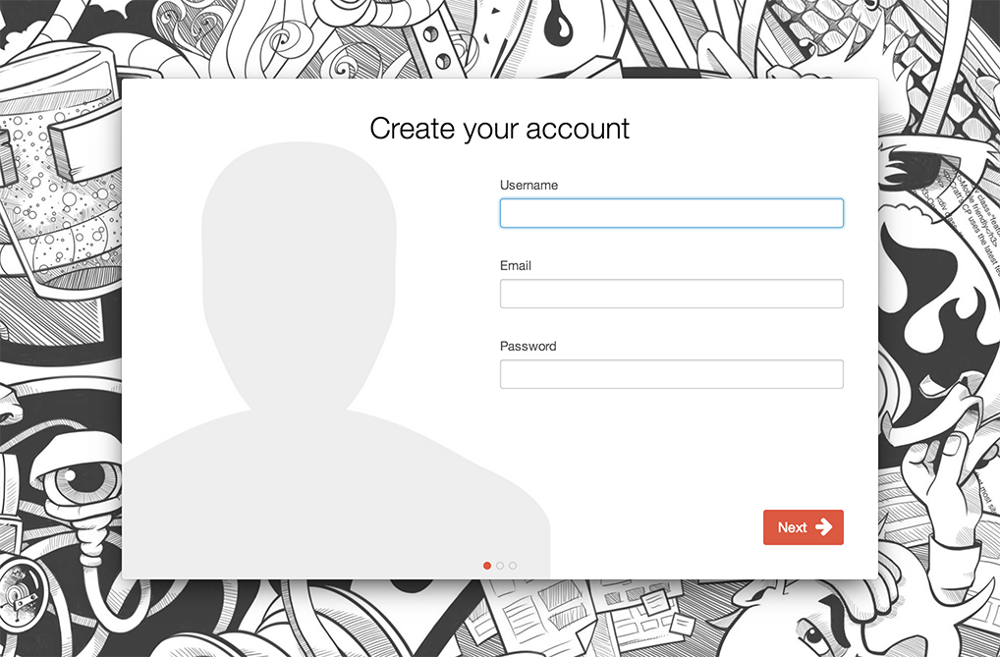
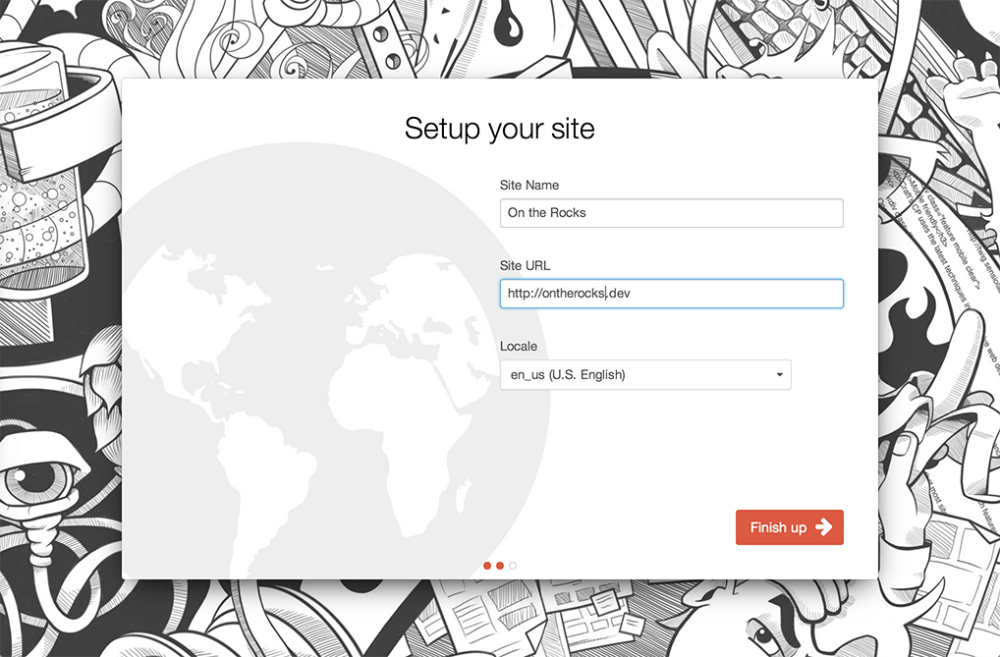
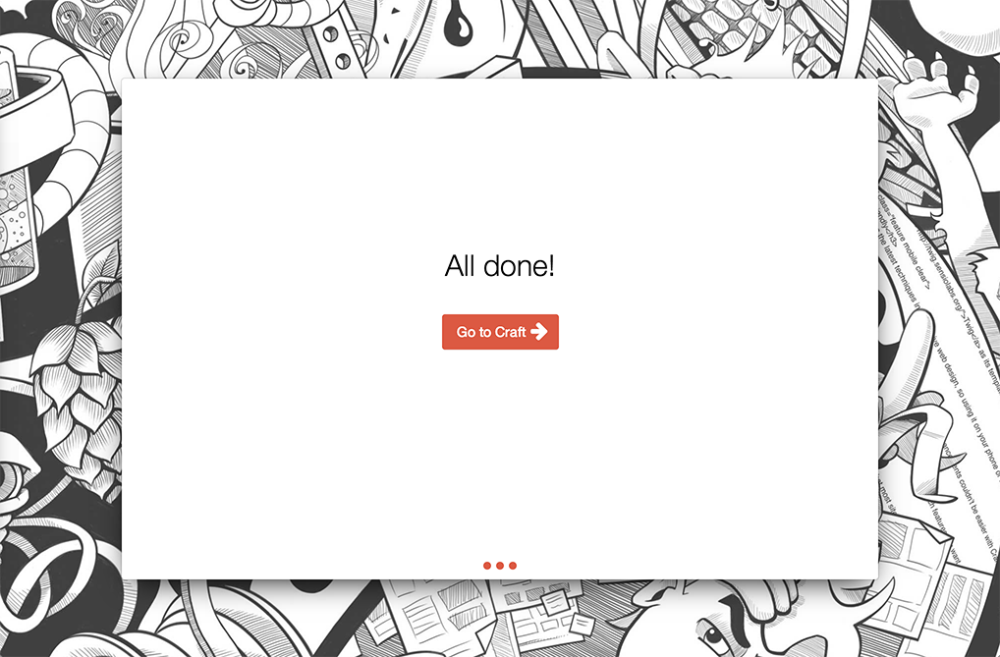
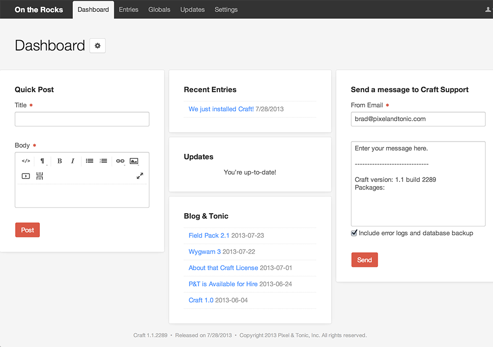

# Installing

::: tip
[Skip to the bottom](#additional-resources) for additional resources and alternative installation options.
:::

## Pre-flight check

Before installing Craft, make sure that you’ve got everything you need:

* The latest version of Craft from [craftcms.com](https://craftcms.com).
* A web host meets Craft’s [minimum requirements](requirements.md).
* An FTP client (we recommend [Transmit](http://panic.com/transmit/)).
* MySQL access, either via a web-based tool like phpMyAdmin, or a standalone app like [Sequel Pro](http://www.sequelpro.com/).
* Your favorite text editor
* Your good looks

### Step 1: Upload the files

Download the archive format you prefer to work with:

- **zip**: <https://craftcms.com/latest-v2.zip>
- **tar.gz**: <https://craftcms.com/latest-v2.tar.gz>

Extract the archive wherever you want your new Craft project to live.

You’ll notice that it contains two folders:

* `craft/`
* `public/`

The `craft/` folder contains [all kinds of stuff](folder-structure.md), from the actual application files to configuration files to your templates. This folder should be uploaded in its entirety to your server.

We recommend that you upload the folder *above* your web root if possible, which will ensure that no one can access any of its files directly. (Your web root is the folder that your domain name points to.) That’s not a requirement, but do it if you can. For the children.

The `public/` folder contains a few files that can go inside your web root. The only file that’s actually required here is `index.php`, which is the web’s official entry point into your Craft site.

By default the `index.php` file assumes that you uploaded the `craft/` folder one level above it. For example, on your server it might look like this:

    craft/
    public_html/
        index.php

If that’s not the case, you will need to open up your `index.php` file and change the `$craftPath` variable to point to the actual location of your `craft/` folder. If the `craft/` folder lives right next to your `index.php` file, you would change that line to this:

```php
$craftPath = './craft';
```

The other files in `public/` are all optional. Here’s what they do:

* `htaccess` – This file configures Apache servers to direct all traffic hitting your site to that `index.php` file, without actually needing to include `index.php` in the URLs. Note that it must be renamed to `.htaccess` (with the dot) for it to actually work. (See “[Removing “index.php” from URLs](https://craftcms.com/support/remove-index.php)” for more info.)
* `web.config` – This is our IIS equivelant of the `.htaccess` file, for those of you that are into that sort of thing.
* `robots.txt` – If you couldn’t upload the `craft/` folder above your web root, you can use this file to prevent Google from indexing it.

::: tip
The `public/` folder should not be uploaded into your web root; it _represents_ your web root. You just need to upload certain files within it.
:::

::: warning
If you’re using Apache, don’t forget to rename `htaccess` to `.htaccess`.
:::

### Step 2: Set the permissions

At a minimum, Craft needs to be able to write to 3 folders on your server:

* `craft/app/`
* `craft/config/`
* `craft/storage/`

Additionally, if you define any [Local Asset sources](assets.md) in your public HTML folder, Craft will need to be able to write to them as well.

In order for Craft to be able to do that, it’s counting on you to set the needed permissions on those folders (and each of their subfolders).

The exact permissions you should be setting depends on the relationship between the system user that PHP is running as, and who owns the actual folders/files.

Here are some recommended permissions depending on that relationship:

* If they are the same user, use `744`.
* If they're in the same group, then use `774`.
* If they’re neither the same user nor in the same group, or if you just prefer to live life on the edge, you can use `777`, just please do not do that in a production environment.

::: tip
**IIS fans**: Make sure the account your site’s AppPool is running as has write permissions to this folder.
:::

### Step 3: Create your database

Next up, you’ll need to create a database for Craft. If you’re given a choice, we recommend that you set the default charset to `utf8` and the default collation to `utf8_unicode_ci`, but the actual charset and collation should be determined by your project’s requirements.

If your host limits you to a single database, and you’re already using it for another app, that should be fine. Craft is perfectly capable of sharing a database with other apps, although we can’t speak for the other apps. All of Craft’s tables will get prefixed with “craft_” by default, so it’s easy to identify them.

### Step 4: Tell Craft how to connect to your database

Open up your `craft/config/db.php` file on your server. This file holds some settings that tell Craft how it can connect to your database.

* Set `server` to the name of your database server.  If your database and web server are on the same box, then this will likely be either `localhost` or `127.0.0.1`.
* Set `user` to the name of the MySQL user Craft should use to connect to the database.
* Set `password` to the password for the MySQL user Craft should use to connect to the database.
* Set `database` to the name of the database Craft should be connecting to.
* Set `tablePrefix` to the prefix you want each of Craft’s tables to use. Note that this must be five characters or less, and it does *not* need to end with “_”. If Craft won’t be sharing its database with any other apps, you’re also free to leave this one blank.

If you need to check with your web host to get the correct values for these settings, that’s OK; we can wait.

Once you’ve finished setting your DB config settings, save the file and close it.

### Step 5: Run the installer!

Now that everything’s set up, point your browser to `http://example.com/admin`. If you see a monkey in your browser, you’ve done everything right!



No monkey? Here’s a couple tips:

* If you’re getting a 404, your server might not be configured to redirect would-be 404’s to `index.php` correctly. Try going to `http://example.com/index.php/admin` or `http://example.com/index.php?p=admin` instead.
* If you’re getting an error about how Craft can’t connect to your DB, you’ll need to revisit Step 4.

The first step of the installer is to create a user account. Don’t be one of *those* people and be sure to pick a strong password.



The next screen will have you define the basic info about your site.



Click the “Finish up” button and let the installer do its thing. A few seconds later, you should have a working Craft install!



Click “Go to Craft” and you’ll get taken straight to the dashboard.



Congratulations, you’ve just installed Craft!

Now get back to work.

## Additional Resources

Here are some additional resources for getting Craft installed in various environments:

### Local Environments

#### [Installing Craft CMS on Mac OS X Using MAMP & Sequel Pro](http://a73cram5ay.blogspot.com/2015/04/installing-craft-cms-on-mac-os-x-using.html)

Guide by Alec Ramsay

#### [The Absolute Beginners Guide to Setting Up Craft on Mac](https://una.im/2013/08/13/the-absolute-beginners-guide-to-setting-up-craft-on-mac/)

Guide by Una Kravets

#### [Craft CMS with Laravel Valet, How to Setup Local Web Development Environment on a Mac](https://3redkites.com/blog/entry/craft-cms-with-laravel-valet-how-to-setup-local-web-development-environment-on-a-mac/)

Guide by Joann, 3 Red Kites

#### [Setting up a local dev environment for Craft CMS with Laravel Homestead](https://medium.com/@mattcollins_6/setting-up-a-local-dev-environment-for-craft-cms-using-laravel-homestead-2724be3954a5)

Guide by Matt Collins

### Remote Environments

#### [How To Install Craft CMS On Cloudways](https://www.cloudways.com/blog/install-craft-cms-on-cloud/)

[Cloudways](https://www.cloudways.com/en/) installation guide by Ahmed Khan

#### [Installing a fresh Craft CMS Installation on Laravel Forge](http://mattstauffer.co/blog/installing-a-fresh-craft-cms-installation-on-laravel-forge)

Guide by Matt Stauffer

#### [One-click Deploy: Craft CMS to DigitalOcean](http://blog.deploybot.com/blog/deploying-craft-cms-to-a-digitalocean-with-deploybot)

[DeployBot](http://deploybot.com/) deployment guide by Eugene Fedorenko, [Wildbit](http://wildbit.com/)

#### [Craft on Heroku](https://medium.com/@aj1215/craft-cms-on-heroku-79b991665b0b)

Guide by AJ Griem

#### [Install Craft CMS 2 on fortrabbit](http://help.fortrabbit.com/install-craft-2)

[fortrabbit](http://www.fortrabbit.com/) installation guide

### Utilities

#### [Craft Deploy](https://github.com/Bluegg/craft-deploy/)

Capistrano deployment utility by [Bluegg](http://bluegg.co.uk/)

#### [Craft Command Line Installer](https://github.com/themccallister/craft)

Local installation utility by Jason McCallister
